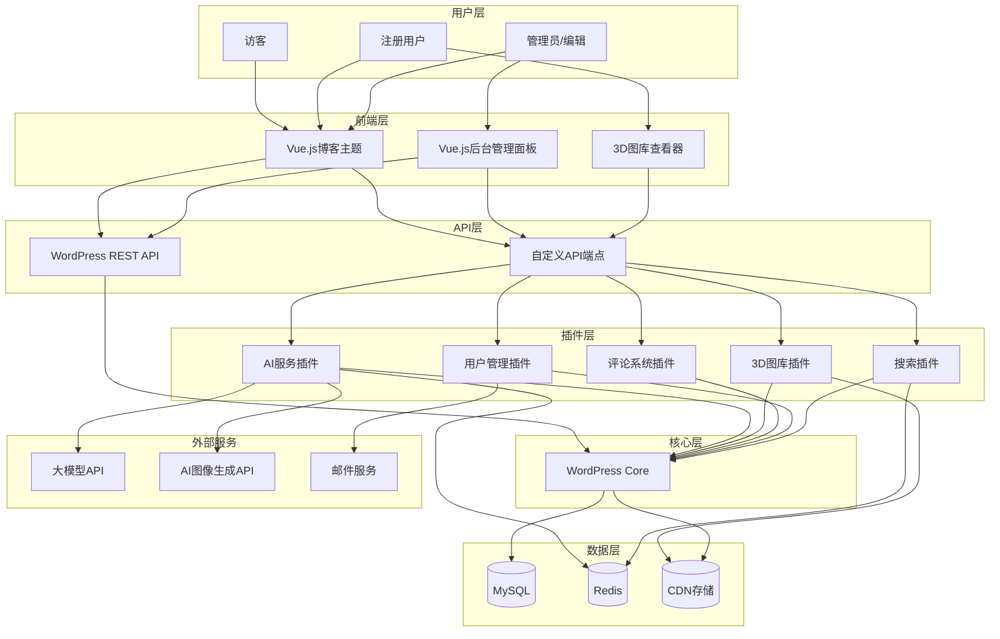
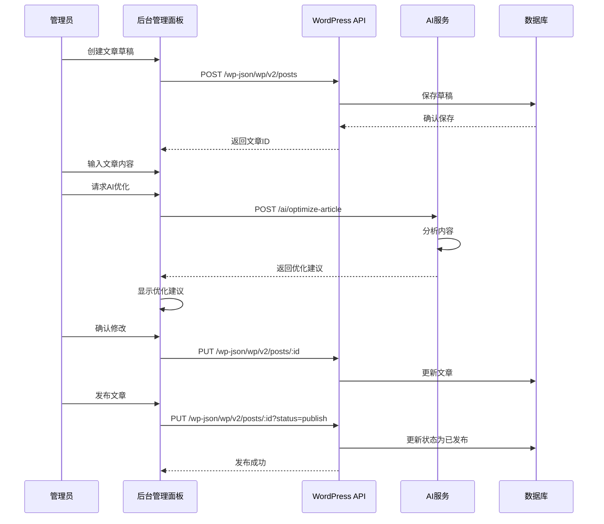
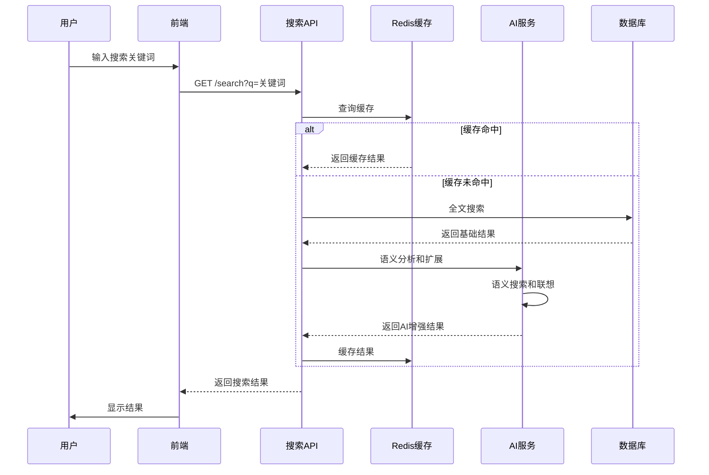
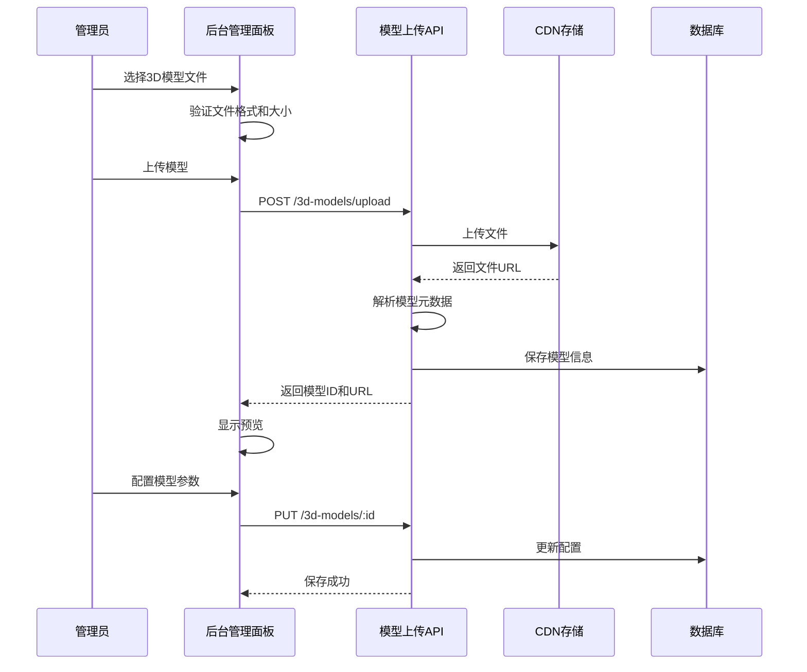
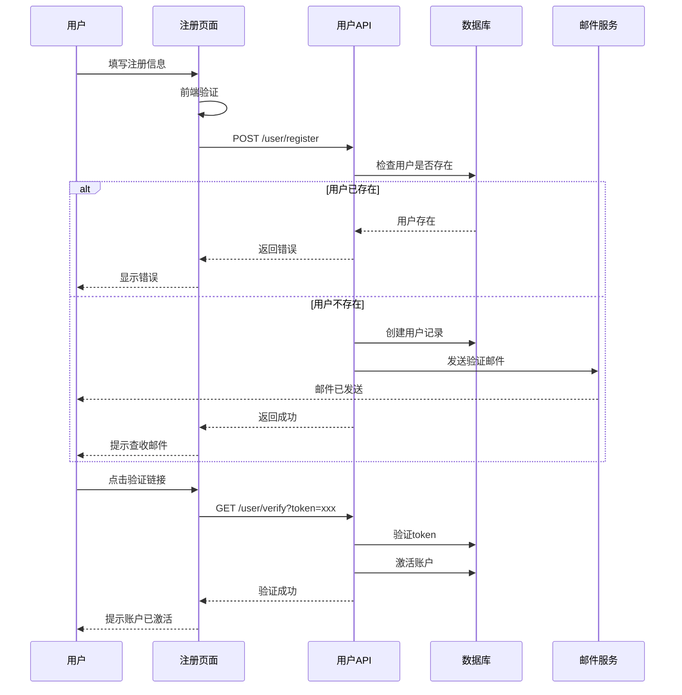

# 架构设计

## 系统概述

小伍同学的个人博客系统基于WordPress内容管理框架构建，采用前后端分离架构，集成大模型AI能力，提供智能化的内容创作和管理体验。系统通过WordPress REST API提供数据服务，前端使用Vue.js构建现代化的用户界面和管理后台，后端通过PHP插件扩展WordPress功能，集成Redis缓存和CDN存储提升性能，通过大模型API提供AI增强能力。

## 技术栈

**语言与运行时**
- PHP 8.1+ - 主要后端语言
- JavaScript (ES2022+) - 前端语言
- MySQL 8.0+ - 关系型数据库
- Redis 6.0+ - 缓存和会话存储

**框架**
- WordPress 6.0+ - 内容管理框架
- Vue.js 3.3+ - 前端框架
- Element Plus - UI组件库
- Three.js - 3D渲染库
- Vite - 前端构建工具

**数据存储**
- MySQL 8.0+ - 主要数据存储
- Redis - 缓存层
- 腾讯云COS/阿里云OSS - CDN对象存储

**基础设施**
- Nginx 1.20+ - Web服务器和反向代理
- PHP-FPM - PHP进程管理
- 腾讯云/阿里云 - 云服务器托管

**外部服务**
- 大模型API（OpenAI/通义千问/文心一言）- AI能力
- AI图像生成API - 图片素材生成
- CDN服务 - 静态资源加速

## 项目结构

```
project-root/
├── wordpress/                      # WordPress核心
│   ├── wp-content/
│   │   ├── themes/
│   │   │   ├── xiaowu-blog/       # 自定义主题
│   │   │   │   ├── assets/        # 前端资源
│   │   │   │   │   ├── js/        # Vue.js应用
│   │   │   │   │   ├── css/       # 样式文件
│   │   │   │   │   └── images/    # 图片资源
│   │   │   │   ├── templates/     # 模板文件
│   │   │   │   └── functions.php  # 主题函数
│   │   ├── plugins/
│   │   │   ├── xiaowu-ai/         # AI功能插件
│   │   │   │   ├── includes/
│   │   │   │   │   ├── ai-service.php      # AI服务封装
│   │   │   │   │   ├── article-optimizer.php  # 文章优化
│   │   │   │   │   ├── smart-search.php      # 智能搜索
│   │   │   │   │   ├── recommendation.php     # 推荐系统
│   │   │   │   │   └── code-generator.php     # 代码生成
│   │   │   │   ├── admin/         # 后台管理页面
│   │   │   │   ├── api/           # 自定义API端点
│   │   │   │   └── assets/        # 插件资源
│   │   │   ├── xiaowu-3d-gallery/ # 3D图库插件
│   │   │   │   ├── includes/
│   │   │   │   │   ├── model-uploader.php   # 模型上传
│   │   │   │   │   ├── three-renderer.php   # 3D渲染
│   │   │   │   │   └── viewer.php          # 查看器
│   │   │   │   ├── assets/
│   │   │   │   └── templates/
│   │   │   ├── xiaowu-comments/    # 评论系统插件
│   │   │   │   ├── includes/
│   │   │   │   ├── admin/
│   │   │   │   └── assets/
│   │   │   ├── xiaowu-user/         # 用户管理插件
│   │   │   │   ├── includes/
│   │   │   │   │   ├── auth.php            # 认证
│   │   │   │   │   ├── registration.php     # 注册
│   │   │   │   │   ├── password-reset.php  # 密码重置
│   │   │   │   │   └── roles.php           # 角色管理
│   │   │   │   ├── admin/
│   │   │   │   └── templates/
│   │   │   └── xiaowu-search/        # 搜索插件
│   │   │       ├── includes/
│   │   │       │   ├── ai-search.php      # AI搜索
│   │   │       │   └── indexer.php         # 索引器
│   │   │       └── assets/
│   │   └── uploads/                  # 上传文件
│   │       ├── 2025/                # 按年组织
│   │       └── models/              # 3D模型文件
│   ├── wp-config.php                # WordPress配置
│   └── .htaccess                    # Nginx/Apache配置
├── admin-panel/                     # Vue.js后台管理面板
│   ├── src/
│   │   ├── components/              # Vue组件
│   │   │   ├── ArticleEditor/       # 文章编辑器
│   │   │   ├── Dashboard/           # 仪表盘
│   │   │   ├── UserManagement/      # 用户管理
│   │   │   ├── CommentModeration/   # 评论审核
│   │   │   ├── AISettings/          # AI配置
│   │   │   ├── ModelGallery/        # 模型图库
│   │   │   └── ImageGenerator/     # 图片生成
│   │   ├── views/                   # 页面视图
│   │   ├── stores/                  # Pinia状态管理
│   │   ├── api/                     # API客户端
│   │   ├── router/                  # 路由配置
│   │   ├── utils/                   # 工具函数
│   │   └── App.vue                  # 根组件
│   ├── public/
│   ├── package.json
│   └── vite.config.js
├── deployment/                      # 部署脚本
│   ├── docker/
│   │   ├── Dockerfile
│   │   ├── docker-compose.yml
│   │   └── nginx/
│   ├── scripts/
│   │   ├── deploy.sh               # 部署脚本
│   │   └── backup.sh               # 备份脚本
│   └── config/
│       ├── nginx.conf              # Nginx配置
│       └── php-fpm.conf            # PHP-FPM配置
├── docs/                            # 文档
└── .env.example                    # 环境变量示例
```

**入口点**
- `wordpress/index.php` - WordPress前端入口
- `wordpress/wp-admin/` - WordPress原生后台
- `admin-panel/src/main.js` - Vue.js后台管理应用入口
- `wordpress/wp-content/plugins/xiaowu-ai/includes/ai-service.php` - AI服务入口

## 子系统

### 内容管理系统（WordPress Core）
**目的**: 提供基础的内容管理能力
**位置**: `wordpress/`
**关键文件**: `wp-config.php`, `wp-includes/`, `wp-admin/`
**依赖**: MySQL数据库
**被依赖**: 所有自定义插件和主题

### AI服务插件（xiaowu-ai）
**目的**: 提供AI辅助功能（文章优化、搜索、推荐、代码生成）
**位置**: `wordpress/wp-content/plugins/xiaowu-ai/`
**关键文件**: `includes/ai-service.php`, `includes/article-optimizer.php`, `includes/smart-search.php`
**依赖**: 大模型API、WordPress REST API
**被依赖**: 主题、后台管理面板

### 3D图库插件（xiaowu-3d-gallery）
**目的**: 提供上传和展示3D模型的功能
**位置**: `wordpress/wp-content/plugins/xiaowu-3d-gallery/`
**关键文件**: `includes/model-uploader.php`, `includes/three-renderer.php`, `viewer.php`
**依赖**: Three.js前端库、CDN存储
**被依赖**: 主题、后台管理面板

### 评论系统插件（xiaowu-comments）
**目的**: 提供评论互动功能
**位置**: `wordpress/wp-content/plugins/xiaowu-comments/`
**关键文件**: `includes/comment-handler.php`, `includes/antispam.php`
**依赖**: WordPress评论系统、用户管理插件
**被依赖**: 主题、后台管理面板

### 用户管理插件（xiaowu-user）
**目的**: 扩展WordPress用户系统，支持访客登录、邮箱验证等
**位置**: `wordpress/wp-content/plugins/xiaowu-user/`
**关键文件**: `includes/auth.php`, `includes/registration.php`, `includes/password-reset.php`
**依赖**: WordPress用户系统、SMTP服务
**被依赖**: 评论系统、AI服务

### 搜索插件（xiaowu-search）
**目的**: 提供智能搜索功能
**位置**: `wordpress/wp-content/plugins/xiaowu-search/`
**关键文件**: `includes/ai-search.php`, `includes/indexer.php`
**依赖**: 大模型API、Redis缓存
**被依赖**: 主题搜索框、后台管理面板

### 后台管理面板（Vue.js Admin）
**目的**: 提供现代化的内容管理和用户管理界面
**位置**: `admin-panel/`
**关键文件**: `src/App.vue`, `src/api/`, `src/stores/`
**依赖**: WordPress REST API、Element Plus、Pinia
**被依赖**: 管理员用户

## 架构图



## 关键流程

### 文章发布流程（AI辅助）



### 智能搜索流程



### 3D模型上传流程



### 用户注册流程



## 设计决策

### 1. 为什么选择WordPress而非自研CMS？
- **理由**: WordPress拥有成熟的插件生态、丰富的主题、庞大的社区支持，可以快速实现博客功能，将开发重点放在AI增强和特色功能上。
- **权衡**: WordPress的性能和扩展性可能不如定制化方案，但通过Redis缓存、CDN加速和插件优化可以满足个人博客的需求。

### 2. 为什么采用前后端分离架构？
- **理由**: Vue.js提供更流畅的用户体验，特别是对于3D图库和AI交互功能；前后端分离便于独立开发和部署。
- **权衡**: 需要维护两套代码库和部署流程，通过标准化API接口和CI/CD流程可以降低复杂度。

### 3. 为什么使用Redis缓存？
- **理由**: 缓存频繁访问的数据（如搜索结果、用户会话、热门文章）可以显著提升访问速度。
- **权衡**: 需要额外的服务器资源和维护成本，但性能提升对用户体验至关重要。

### 4. 为什么AI服务使用可配置的API密钥？
- **理由**: 支持多个大模型服务商（OpenAI、通义千问等），避免单一供应商依赖，用户可根据成本和效果灵活选择。
- **权衡**: 需要维护多个API的适配层，但通过统一的服务接口可以降低复杂度。

### 5. 为什么3D图库使用CDN存储？
- **理由**: 3D模型文件通常较大，CDN提供全球加速和稳定的存储服务，降低服务器负载。
- **权衡**: CDN服务产生额外费用，但相比于服务器带宽成本和性能提升是值得的。
