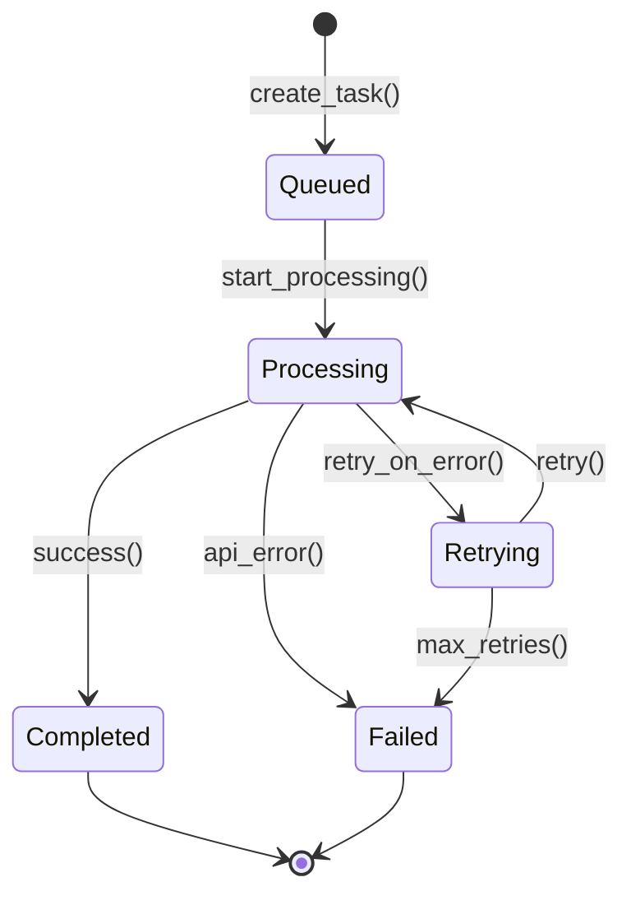
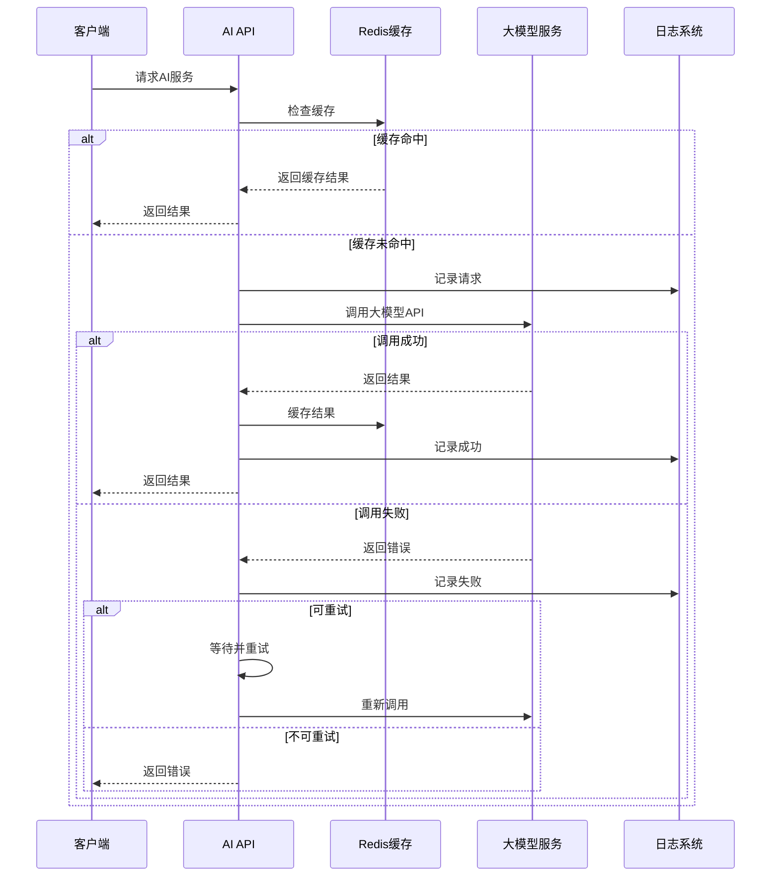

# AI服务（AI Service）

AI服务是小伍同学个人博客系统的核心组件，集成大模型能力，提供文章优化、智能搜索、内容推荐、代码生成、联网搜索等功能。

## 什么是AI服务？

AI服务是对外开放的大模型接口封装层，统一管理不同AI服务商的API调用，提供标准化的AI能力接口。系统支持OpenAI、通义千问、文心一言等多种模型，可根据成本和效果灵活切换。

**关键特征**:
- 多模型支持，可灵活切换
- 统一的API接口封装
- 可配置的提示词模板
- 智能缓存减少API调用
- 异步任务处理
- 详细的调用日志

## 代码位置

| 方面 | 位置 |
|------|------|
| AI服务主类 | `xiaowu-ai/includes/ai-service.php` |
| 文章优化 | `xiaowu-ai/includes/article-optimizer.php` |
| 智能搜索 | `xiaowu-ai/includes/smart-search.php` |
| 推荐系统 | `xiaowu-ai/includes/recommendation.php` |
| 代码生成 | `xiaowu-ai/includes/code-generator.php` |
| 联网搜索 | `xiaowu-ai/includes/web-search.php` |
| API端点 | `xiaowu-ai/api/` |
| 前端集成 | `admin-panel/src/api/ai.js` |
| 配置管理 | `admin-panel/src/stores/ai.ts` |

## 结构

```php
// AI服务数据结构
class AIService {
    // 服务配置
    public $provider;              // AI服务商
    public $api_key;               // API密钥
    public $model;                 // 模型名称
    public $max_tokens;            // 最大token数
    public $temperature;           // 温度参数

    // 提示词模板
    public $prompts;               // 提示词模板
    // {
    //   "blog_context": "这是小伍同学的个人博客...",
    //   "article_optimization": "请优化以下文章...",
    //   "code_generation": "请生成以下功能的代码..."
    // }

    // 调用统计
    public $stats;                 // 统计数据
    // {
    //   "total_calls": 1000,
    //   "success_rate": 0.98,
    //   "avg_response_time": 2.5,
    //   "total_tokens": 50000
    // }
}
```

### AI任务数据结构

```php
class AITask {
    public $id;                   // 任务ID
    public $type;                 // 任务类型
    public $input;                // 输入数据
    public $status;               // 状态
    public $result;               // 结果
    public $error;                // 错误信息
    public $tokens_used;          // 使用的token数
    public $cost;                 // 成本
    public $created_at;           // 创建时间
    public $completed_at;        // 完成时间
    public $user_id;              // 用户ID
}
```

### 关键字段

| 字段 | 类型 | 描述 | 约束 |
|------|------|------|------|
| `provider` | `enum` | AI服务商 | openai, qwen, wenxin等 |
| `api_key` | `string` | API密钥 | 必需，加密存储 |
| `model` | `string` | 模型名称 | 有效的模型标识符 |
| `max_tokens` | `integer` | 最大token数 | 1-100000 |
| `temperature` | `float` | 温度参数 | 0.0-2.0 |
| `prompts` | `object` | 提示词模板 | JSON格式 |

## 不变量

这些规则对有效的AI服务必须始终成立：

1. **API密钥保密**: API密钥绝不能记录到日志或暴露给客户端
2. **模型有效性**: 模型名称必须是服务商支持的模型
3. **Token限制**: 单次调用不能超过模型的最大token限制
4. **成本控制**: 必须监控和限制API调用成本
5. **错误处理**: 所有API调用必须有错误处理和重试机制

## 生命周期



### 状态描述

| 状态 | 描述 | 允许的转换 |
|------|------|-----------|
| `queued` | 任务已创建，等待处理 | → processing |
| `processing` | 正在处理中 | → completed, failed, retrying |
| `retrying` | 重试中（网络错误等） | → processing, failed |
| `completed` | 已成功完成（终态） | 无 |
| `failed` | 失败（终态） | 无 |

## 支持的AI服务商

| 服务商 | 模型 | 特点 | 适用场景 |
|--------|------|------|---------|
| OpenAI | GPT-4, GPT-3.5 | 能力最强，成本较高 | 复杂任务 |
| 通义千问 | qwen-turbo, qwen-plus | 中文优化，成本适中 | 中文内容 |
| 文心一言 | ERNIE-Bot | 百度生态，本地化 | 中文场景 |
| Claude | claude-3 | 长上下文 | 长文本处理 |

## 核心功能

### 1. 文章优化

AI对文章进行多维度优化：

```php
$optimization = [
    'title' => [
        'original' => '原始标题',
        'suggested' => '优化后的标题',
        'reason' => '更吸引眼球，包含关键词'
    ],
    'content' => [
        'suggestions' => [
            '添加引言段落',
            '调整段落长度',
            '添加小标题'
        ]
    ],
    'seo' => [
        'keywords' => ['关键词1', '关键词2'],
        'meta_description' => '建议的元描述'
    ],
    'readability' => [
        'score' => 85,
        'suggestions' => ['简化复杂句式']
    ]
];
```

### 2. 智能搜索

AI增强的搜索功能：

```php
$search_result = [
    'results' => [
        [
            'type' => 'post',
            'id' => 1,
            'title' => '文章标题',
            'excerpt' => '文章摘要',
            'relevance' => 0.95,
            'reason' => '语义匹配度高'
        ]
    ],
    'suggestions' => ['搜索建议1', '搜索建议2']
];
```

### 3. 内容推荐

基于用户行为和内容特征推荐：

```php
$recommendations = [
    'items' => [
        [
            'type' => 'post',
            'id' => 10,
            'title' => '推荐文章',
            'reason' => '基于您最近阅读的文章',
            'relevance' => 0.92
        ]
    ],
    'algorithm' => 'collaborative_filtering',
    'personalized' => true
];
```

### 4. 代码生成

根据描述生成代码：

```php
$code_generation = [
    'code' => '<?php\nfunction shortcode_function() {\n  // implementation\n}',
    'language' => 'php',
    'explanation' => '这段代码创建了一个WordPress短代码',
    'file_suggestion' => 'functions.php',
    'dependencies' => [],
    'tested' => false
];
```

### 5. 联网搜索

AI联网搜索并整理结果：

```php
$web_search = [
    'results' => [
        [
            'title' => '搜索结果标题',
            'url' => 'https://example.com',
            'snippet' => '内容摘要',
            'source' => 'example.com',
            'published_date' => '2025-01-22'
        }
    ],
    'summary' => '搜索结果总结',
    'key_points' => ['要点1', '要点2']
];
```

## 提示词管理

### 博客上下文提示词

```markdown
你是小伍同学个人博客的AI助手。博客主要分享技术文章、学习笔记和开发心得。
目标读者是技术爱好者和开发者。内容风格应该专业但友好，技术准确但易懂。
```

### 文章优化提示词

```markdown
请优化以下博客文章，包括：
1. 标题优化：使其更吸引眼球且包含关键词
2. 内容结构：添加适当的小标题和段落划分
3. SEO优化：建议关键词和元描述
4. 可读性：提高文章的可读性评分

博客内容：
{content}
```

### 代码生成提示词

```markdown
请为WordPress博客生成以下功能的{language}代码：
{description}

要求：
1. 遵循WordPress最佳实践
2. 包含安全检查
3. 添加必要的注释
4. 考虑性能优化
```

## API调用流程



## 常见操作

### 初始化AI服务

```php
// 初始化AI服务
$aiService = new AIService([
    'provider' => 'openai',
    'api_key' => get_option('xiaowu_ai_api_key'),
    'model' => 'gpt-4',
    'max_tokens' => 4000,
    'temperature' => 0.7
]);

// 加载提示词模板
$aiService->loadPrompts(get_option('xiaowu_ai_prompts'));
```

### 文章优化

```php
// 优化文章
$result = $aiService->optimizeArticle([
    'title' => $article_title,
    'content' => $article_content,
    'language' => 'zh-CN',
    'target_audience' => 'developers'
]);

// 应用优化
$optimized_title = $result['optimization']['title']['suggested'];
$optimized_content = $aiService->applySuggestions($article_content, $result['optimization']['content']['suggestions']);
```

### 智能搜索

```php
// AI搜索
$search_result = $aiService->search([
    'query' => $search_query,
    'context' => [
        'user_preferences' => $user->getPreferences(),
        'recent_posts' => $user->getRecentPosts()
    ],
    'limit' => 10
]);
```

### 代码生成

```php
// 生成代码
$code_result = $aiService->generateCode([
    'description' => '创建一个短代码显示最新文章',
    'language' => 'php',
    'framework' => 'wordpress',
    'context' => [
        'file' => 'functions.php',
        'purpose' => 'shortcode'
    ]
]);
```

### 联网搜索

```php
// 联网搜索
$web_result = $aiService->webSearch([
    'query' => 'WordPress最新版本特性',
    'num_results' => 5,
    'language' => 'zh-CN'
]);
```

## 性能优化

1. **Redis缓存**: 缓存AI响应，减少重复调用
2. **批量处理**: 将多个请求合并为一次API调用
3. **异步处理**: 使用队列处理耗时任务
4. **结果复用**: 相似请求复用之前的结果
5. **Token优化**: 精简提示词，减少token使用

```php
// 缓存示例
$cache_key = 'ai_optimize_' . md5($content);
$cached_result = wp_cache_get($cache_key, 'xiaowu_ai');

if (false === $cached_result) {
    $result = $aiService->optimizeArticle($content);
    wp_cache_set($cache_key, $result, 'xiaowu_ai', 3600);
}
```

## 成本控制

1. **预算限制**: 设置每月最大API调用成本
2. **Token限制**: 限制单次调用的最大token数
3. **模型选择**: 根据任务复杂度选择合适的模型
4. **缓存优先**: 优先使用缓存结果
5. **监控告警**: 超过阈值时发送告警

```php
// 成本监控
$monthly_cost = $aiService->getMonthlyCost();
$max_budget = get_option('xiaowu_ai_max_budget', 100);

if ($monthly_cost > $max_budget * 0.9) {
    wp_mail(get_option('admin_email'), 'AI API预算警告', '本月AI API调用已接近预算上限');
}
```

## 安全考虑

1. **API密钥加密**: 使用WordPress加密选项存储密钥
2. **敏感数据过滤**: 不将敏感信息发送给AI
3. **输出过滤**: 过滤AI输出中的敏感信息
4. **访问控制**: 限制AI服务的访问权限
5. **日志脱敏**: 日志中不记录敏感数据

```php
// API密钥加密
$encrypted_key = wp_encrypt($api_key);
update_option('xiaowu_ai_api_key', $encrypted_key);

// 解密
$decrypted_key = wp_decrypt(get_option('xiaowu_ai_api_key'));
```

## 监控与分析

### 调用统计

```php
$stats = [
    'total_calls' => 1000,
    'success_calls' => 980,
    'failed_calls' => 20,
    'success_rate' => 0.98,
    'avg_response_time' => 2.5,
    'total_tokens' => 50000,
    'estimated_cost' => 25.00,
    'by_type' => [
        'article_optimization' => 400,
        'search' => 300,
        'code_generation' => 200,
        'web_search' => 100
    ]
];
```

### 性能指标

- 响应时间: 平均 < 3秒
- 成功率: > 95%
- 成本控制: 不超过预算
- 缓存命中率: > 60%
