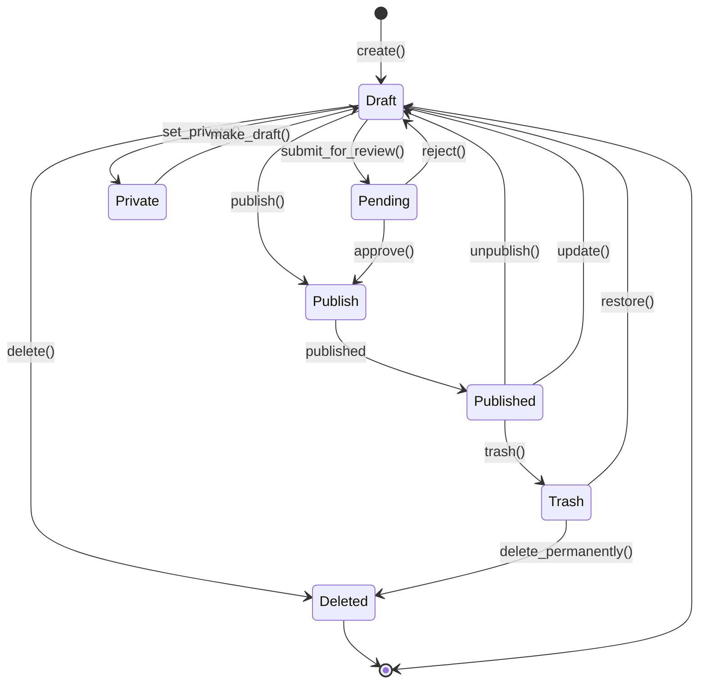
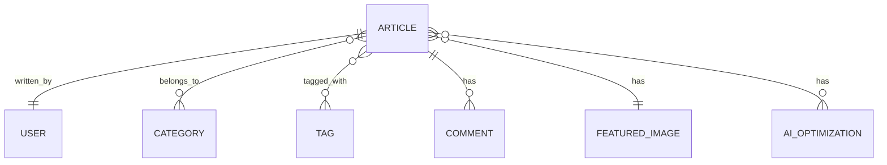

# 文章（Article）

文章是小伍同学个人博客的核心内容单元，用于发布博客文章、教程、心得等内容。文章支持AI辅助优化、分类标签、评论互动等功能。

## 什么是文章？

文章是博客系统中最主要的内容类型，包含标题、正文、元数据等信息。文章可以分配到不同的分类和标签，支持富文本编辑和Markdown格式。

**关键特征**:
- 支持多种状态（草稿、已发布、私有等）
- 可分配分类和标签
- 支持特色图片
- 可设置发布时间和修改时间
- 支持评论互动
- AI辅助优化和排版

## 代码位置

| 方面 | 位置 |
|------|------|
| WordPress文章类型 | WordPress核心 `post` 类型 |
| 自定义文章类型 | `xiaowu-ai/includes/article-type.php` |
| AI优化服务 | `xiaowu-ai/includes/article-optimizer.php` |
| 文章API | `wp-json/wp/v2/posts` |
| 文章编辑器 | `admin-panel/src/components/ArticleEditor/` |
| 文章测试 | `tests/integration/article.test.ts` |

## 结构

```php
// WordPress文章数据结构
class WP_Post {
    public $ID;                  // 文章ID
    public $post_author;         // 作者ID
    public $post_date;           // 发布日期
    public $post_date_gmt;       // 发布日期（GMT）
    public $post_content;        // 文章内容
    public $post_title;          // 文章标题
    public $post_excerpt;        // 文章摘要
    public $post_status;         // 文章状态
    public $comment_status;      // 评论状态
    public $ping_status;         // ping状态
    public $post_password;       // 密码保护
    public $post_name;           // 文章别名
    public $to_ping;             // 要ping的URL
    public $pinged;              // 已ping的URL
    public $post_modified;       // 修改日期
    public $post_modified_gmt;   // 修改日期（GMT）
    public $post_content_filtered; // 过滤后的内容
    public $post_parent;         // 父文章ID
    public $guid;                // 全局唯一标识
    public $menu_order;          // 菜单顺序
    public $post_type;           // 文章类型
    public $post_mime_type;      // MIME类型
    public $comment_count;       // 评论数量
}
```

### 关键字段

| 字段 | 类型 | 描述 | 约束 |
|------|------|------|------|
| `ID` | `integer` | 唯一标识 | 自增，不可变 |
| `post_title` | `string` | 文章标题 | 必需，最大200字符 |
| `post_content` | `string` | 文章内容 | 支持HTML和Markdown |
| `post_status` | `enum` | 文章状态 | draft, publish, private 等 |
| `post_author` | `integer` | 作者ID | 必须存在于users表 |
| `post_date` | `datetime` | 发布时间 | 自动生成或手动设置 |
| `comment_status` | `enum` | 评论状态 | open, closed |

## 不变量

这些规则对有效的文章必须始终成立：

1. **已发布文章必须有标题**: 文章状态为 `publish` 时，标题不能为空
2. **已发布文章必须有内容**: 文章状态为 `publish` 时，内容不能为空
3. **作者必须存在**: `post_author` 必须指向有效的用户记录
4. **日期顺序**: `post_date` 必须早于或等于 `post_modified`
5. **URL唯一性**: 同一状态下，`post_name`（别名）必须唯一

## 生命周期



### 状态描述

| 状态 | 描述 | 允许的转换 |
|------|------|-----------|
| `draft` | 草稿状态，作者可以编辑 | → publish, pending, private, deleted |
| `publish` | 已发布，公众可见 | → draft, trash |
| `pending` | 待审核，等待管理员审核 | → publish, draft |
| `private` | 私有，仅作者可见 | → draft |
| `trash` | 回收站，可以恢复 | → deleted, draft |
| `deleted` | 已删除（终态） | 无 |

## 关系



| 关联实体 | 关系 | 描述 |
|---------|------|------|
| User | 属于 | 每篇文章属于一个作者 |
| Category | 多对多 | 文章可以属于多个分类 |
| Tag | 多对多 | 文章可以有多个标签 |
| Comment | 一对多 | 文章可以有多条评论 |
| Featured Media | 多对一 | 文章可以有一个特色图片 |
| AI Optimization | 一对多 | 文章可以有多个AI优化记录 |

## AI辅助功能

### 文章优化

AI服务可以对文章进行多维度优化：

```php
// 优化请求
$optimization = [
    'type' => 'seo|readability|style',
    'language' => 'zh-CN',
    'target_audience' => 'developers'
];

// AI返回的优化建议
$suggestions = [
    [
        'type' => 'title',
        'original' => '原始标题',
        'suggested' => '优化后的标题',
        'reason' => '更吸引眼球，包含关键词'
    ],
    [
        'type' => 'structure',
        'suggestion' => '添加小标题',
        'reason' => '提高可读性'
    ]
];
```

### 智能排版

AI可以自动：
- 优化段落长度
- 添加小标题
- 调整句子结构
- 生成摘要
- 提取关键词

### 代码生成

AI可以根据描述生成博客功能代码：

```php
// 示例：生成短代码
$description = '创建一个短代码显示最新文章，参数limit控制显示数量';
$code = $aiService->generateCode($description, 'php', 'wordpress');
```

## 常见操作

### 创建文章

```php
// 创建草稿
$post_id = wp_insert_post([
    'post_title' => '我的第一篇文章',
    'post_content' => '文章内容...',
    'post_status' => 'draft',
    'post_author' => get_current_user_id()
]);
```

### 发布文章

```php
// 发布文章
wp_update_post([
    'ID' => $post_id,
    'post_status' => 'publish'
]);
```

### AI优化文章

```javascript
// 前端调用AI优化
const response = await fetch('/wp-json/xiaowu-ai/v1/optimize-article', {
  method: 'POST',
  headers: {
    'Content-Type': 'application/json',
    'Authorization': `Bearer ${token}`
  },
  body: JSON.stringify({
    title: articleTitle,
    content: articleContent,
    type: 'seo'
  })
});
```

### 获取文章列表

```php
// 获取最新文章
$posts = get_posts([
    'numberposts' => 10,
    'post_status' => 'publish',
    'orderby' => 'date',
    'order' => 'DESC'
]);
```

## 性能考虑

- 使用 `WP_Query` 缓存查询结果
- 对于长列表使用分页
- 使用 excerpt 减少内容传输
- 异步加载评论
- 使用CDN缓存静态内容
