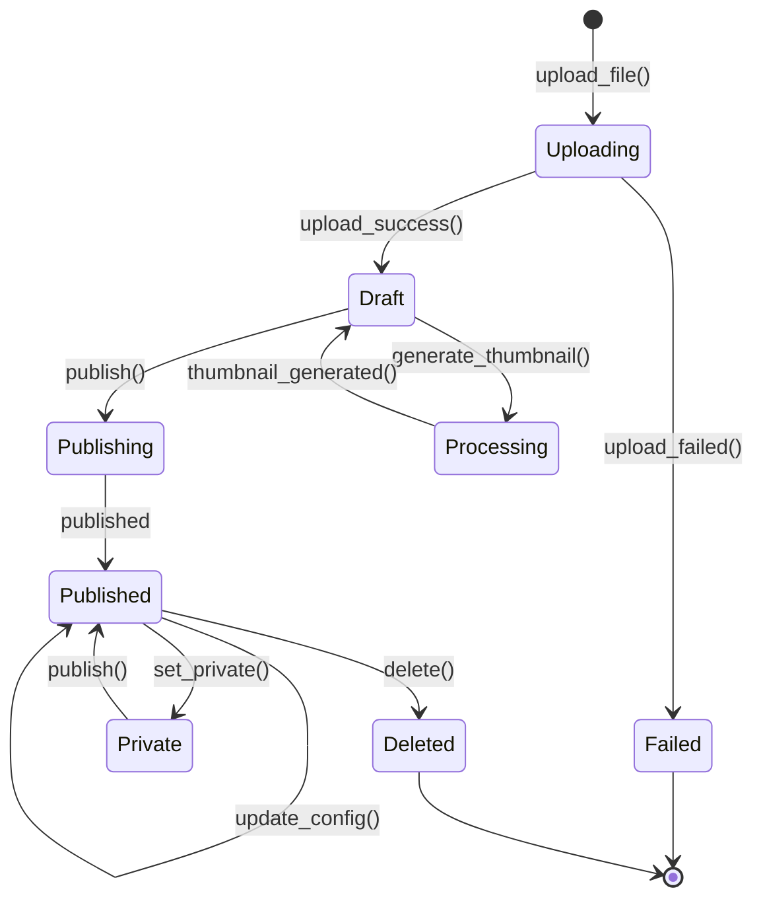
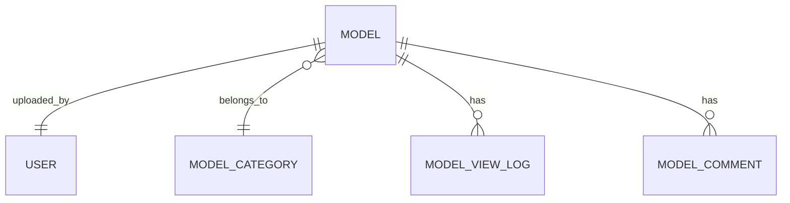
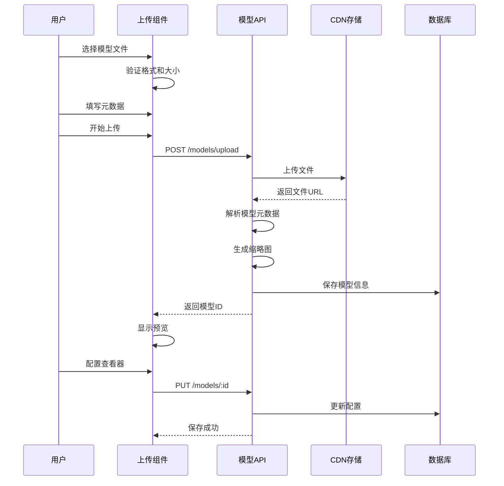
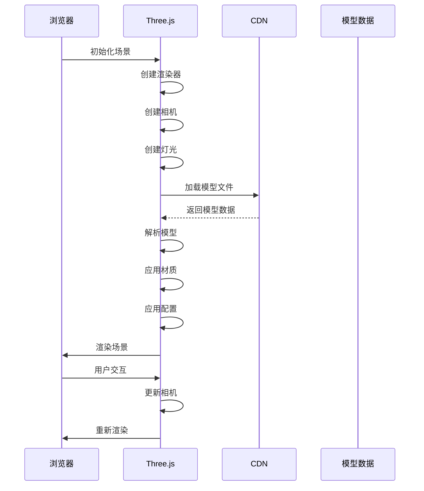

# 3D模型（3D Model）

3D模型是小伍同学个人博客的特色内容类型，用于展示三维模型、交互式图形等内容。模型支持多种格式，通过Three.js在前端渲染，提供交互式查看体验。

## 什么是3D模型？

3D模型是表示三维物体的数据文件，可以在浏览器中通过WebGL进行渲染。博客系统支持上传、展示和管理3D模型，提供在线预览和交互功能。

**关键特征**:
- 支持多种3D文件格式（GLB, GLTF, OBJ, FBX等）
- 浏览器端实时渲染
- 支持交互操作（旋转、缩放、平移）
- 自动生成缩略图
- 可配置显示参数
- 存储在CDN上加速访问

## 代码位置

| 方面 | 位置 |
|------|------|
| 自定义文章类型 | `xiaowu-3d-gallery/includes/model-post-type.php` |
| 模型上传器 | `xiaowu-3d-gallery/includes/model-uploader.php` |
| Three.js渲染器 | `xiaowu-3d-gallery/includes/three-renderer.php` |
| 模型查看器 | `xiaowu-3d-gallery/templates/model-viewer.php` |
| 模型API | `wp-json/xiaowu-3d/v1/models` |
| 前端组件 | `admin-panel/src/components/ModelGallery/` |
| 前端查看器 | `assets/js/three-viewer.js` |

## 结构

```php
// 3D模型数据结构（自定义文章类型 + 元数据）
class Model_3D {
    public $id;                  // 模型ID（文章ID）
    public $title;               // 模型标题
    public $description;         // 模型描述
    public $file_url;            // 模型文件URL
    public $file_size;           // 文件大小（字节）
    public $file_format;         // 文件格式（glb, gltf, obj等）
    public $thumbnail_url;       // 缩略图URL
    public $cdn_url;             // CDN访问URL
    public $category;            // 分类
    public $view_count;          // 查看次数
    public $download_count;      // 下载次数
    public $status;              // 状态
    public $author_id;           // 上传者ID
    public $created_at;          // 创建时间
    public $updated_at;          // 更新时间

    // 查看器配置
    public $viewer_config;       // 查看器配置（JSON）
    // {
    //   "auto_rotate": true,
    //   "rotate_speed": 1.0,
    //   "enable_zoom": true,
    //   "enable_pan": true,
    //   "lighting": "studio",
    //   "background_color": "#ffffff",
    //   "camera_position": {"x": 0, "y": 0, "z": 5}
    // }

    // 模型元数据
    public $model_metadata;      // 模型元数据（JSON）
    // {
    //   "vertices": 1000,
    //   "faces": 500,
    //   "materials": ["Material1"],
    //   "animations": ["Animation1"],
    //   "textures": ["texture1.png"]
    // }
}
```

### 关键字段

| 字段 | 类型 | 描述 | 约束 |
|------|------|------|------|
| `id` | `integer` | 唯一标识 | 自增，不可变 |
| `title` | `string` | 模型标题 | 必需，最大200字符 |
| `file_url` | `string` | 模型文件URL | 必需，有效URL |
| `file_format` | `enum` | 文件格式 | glb, gltf, obj, fbx等 |
| `file_size` | `integer` | 文件大小 | 最大100MB |
| `status` | `enum` | 状态 | draft, publish, private |
| `author_id` | `integer` | 上传者ID | 必须存在于users表 |

## 不变量

这些规则对有效的3D模型必须始终成立：

1. **文件格式有效**: 文件格式必须是支持的类型之一
2. **文件大小限制**: 文件大小不能超过100MB
3. **URL可访问**: 文件URL必须是可访问的CDN地址
4. **标题非空**: 发布状态时标题不能为空
5. **作者存在**: author_id 必须指向有效的用户

## 生命周期



### 状态描述

| 状态 | 描述 | 允许的转换 |
|------|------|-----------|
| `uploading` | 正在上传中 | → draft, failed |
| `draft` | 草稿，不可公开查看 | → processing, publishing, deleted |
| `processing` | 正在处理（生成缩略图等） | → draft |
| `publishing` | 正在发布 | → published |
| `published` | 已发布，公开可见 | → private, deleted |
| `private` | 私有，仅作者可见 | → published, deleted |
| `failed` | 上传失败 | deleted |
| `deleted` | 已删除（终态） | 无 |

## 关系



| 关联实体 | 关系 | 描述 |
|---------|------|------|
| User | 属于 | 每个模型属于一个用户 |
| Model Category | 多对一 | 模型属于一个分类 |
| Model View Log | 一对多 | 模型有多条查看记录 |
| Model Comment | 一对多 | 模型有多条评论 |

## 支持的文件格式

| 格式 | 扩展名 | 描述 | 推荐场景 |
|------|--------|------|---------|
| glTF | .glb | 单文件格式，包含模型、材质、动画 | 推荐，Web优化 |
| glTF | .gltf | JSON格式，可分离材质和纹理 | 需要灵活配置 |
| OBJ | .obj | 纯几何格式，不包含材质 | 简单模型 |
| FBX | .fbx | Autodesk格式，完整场景 | 复杂场景 |

## 查看器配置

### 自动旋转

```json
{
  "auto_rotate": true,
  "rotate_speed": 1.0
}
```

### 灯光设置

```json
{
  "lighting": "studio",
  "lights": [
    {
      "type": "ambient",
      "intensity": 0.5,
      "color": "#ffffff"
    },
    {
      "type": "directional",
      "intensity": 1.0,
      "position": {"x": 5, "y": 10, "z": 7.5}
    }
  ]
}
```

### 相机设置

```json
{
  "camera_position": {"x": 0, "y": 0, "z": 5},
  "camera_target": {"x": 0, "y": 0, "z": 0},
  "enable_zoom": true,
  "enable_pan": true,
  "min_distance": 2,
  "max_distance": 10
}
```

### 环境设置

```json
{
  "background_type": "color",
  "background_color": "#ffffff",
  "environment_map": "studio.hdr"
}
```

## 上传流程



## 渲染流程



## 常见操作

### 上传模型

```php
// 上传模型文件
$file = $_FILES['model'];
$allowed_formats = ['glb', 'gltf', 'obj', 'fbx'];
$max_size = 100 * 1024 * 1024; // 100MB

$upload = wp_handle_upload($file, [
    'test_form' => false,
    'mimes' => [
        'glb' => 'model/gltf-binary',
        'gltf' => 'model/gltf+json',
        'obj' => 'model/obj',
        'fbx' => 'model/fbx'
    ]
]);

if ($upload && !isset($upload['error'])) {
    // 上传到CDN
    $cdn_url = upload_to_cdn($upload['file']);

    // 创建模型记录
    $model_id = wp_insert_post([
        'post_title' => sanitize_text_field($_POST['title']),
        'post_content' => sanitize_textarea_field($_POST['description']),
        'post_type' => 'model_3d',
        'post_status' => 'draft',
        'post_author' => get_current_user_id()
    ]);

    // 保存元数据
    update_post_meta($model_id, '_model_file_url', $cdn_url);
    update_post_meta($model_id, '_model_file_format', pathinfo($upload['name'], PATHINFO_EXTENSION));
    update_post_meta($model_id, '_model_file_size', filesize($upload['file']));

    // 生成缩略图
    generate_thumbnail($cdn_url, $model_id);
}
```

### 获取模型

```php
// 获取模型详情
$model_id = get_the_ID();
$model = [
    'id' => $model_id,
    'title' => get_the_title(),
    'description' => get_the_content(),
    'file_url' => get_post_meta($model_id, '_model_file_url', true),
    'file_format' => get_post_meta($model_id, '_model_file_format', true),
    'thumbnail_url' => get_post_meta($model_id, '_model_thumbnail_url', true),
    'viewer_config' => get_post_meta($model_id, '_viewer_config', true),
    'view_count' => get_post_meta($model_id, '_view_count', true) ?: 0
];
```

### 更新模型

```javascript
// 前端更新模型配置
const response = await fetch(`/wp-json/xiaowu-3d/v1/models/${modelId}`, {
  method: 'PUT',
  headers: {
    'Content-Type': 'application/json',
    'Authorization': `Bearer ${token}`
  },
  body: JSON.stringify({
    viewer_config: {
      auto_rotate: true,
      lighting: 'studio',
      background_color: '#ffffff'
    }
  })
});
```

### 删除模型

```php
// 删除模型（从数据库和CDN）
function delete_model($model_id) {
    // 获取文件URL
    $file_url = get_post_meta($model_id, '_model_file_url', true);
    $thumbnail_url = get_post_meta($model_id, '_model_thumbnail_url', true);

    // 从CDN删除文件
    delete_from_cdn($file_url);
    delete_from_cdn($thumbnail_url);

    // 删除数据库记录
    wp_delete_post($model_id, true);
}
```

## 性能优化

1. **CDN加速**: 模型文件存储在CDN上，全球加速
2. **文件压缩**: 使用Draco压缩器压缩GLTF模型
3. **LOD**: 为大模型创建多细节层次（Level of Detail）
4. **异步加载**: 使用Promise异步加载模型
5. **缓存**: 浏览器缓存已加载的模型
6. **按需加载**: 只加载可见区域的模型

```javascript
// 使用Draco压缩
const loader = new GLTFLoader();
loader.setDRACOLoader(new DRACOLoader());
loader.setDRACOLoaderPath('/path/to/draco/');

// 异步加载
async function loadModel(url) {
  const loader = new GLTFLoader();
  const gltf = await loader.loadAsync(url);
  return gltf.scene;
}
```

## AI增强

### AI生成模型描述

使用大模型自动生成模型描述和标签：

```php
$description = $aiService->generateDescription([
    'model_type' => 'character',
    'model_style' => 'realistic',
    'model_features' => ['has_animations', 'has_textures']
]);
```

### AI生成缩略图

使用AI图像生成服务为3D模型生成美观的缩略图。

### AI推荐相似模型

基于模型特征，AI可以推荐相似的模型给用户。

## 安全考虑

1. **文件验证**: 严格验证文件格式和内容
2. **大小限制**: 限制上传文件大小
3. **病毒扫描**: 扫描上传文件（可选）
4. **权限检查**: 只允许有权限的用户上传和删除
5. **CDN安全**: 使用签名URL防止未授权访问
