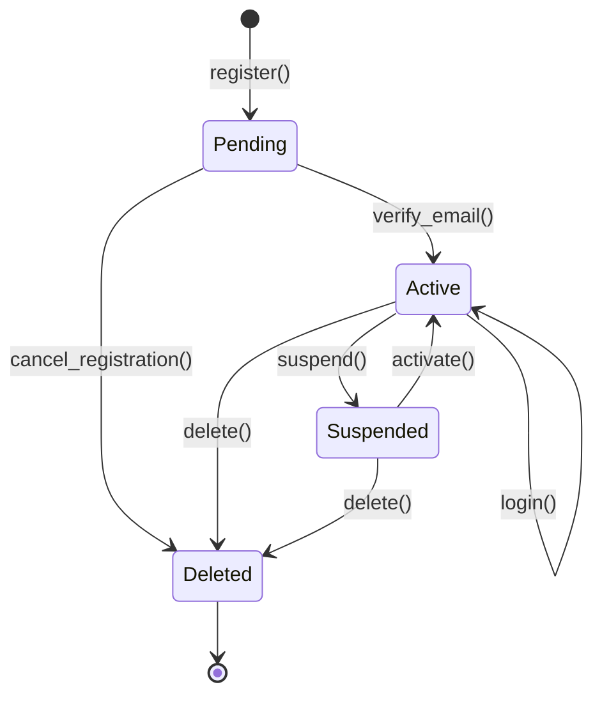
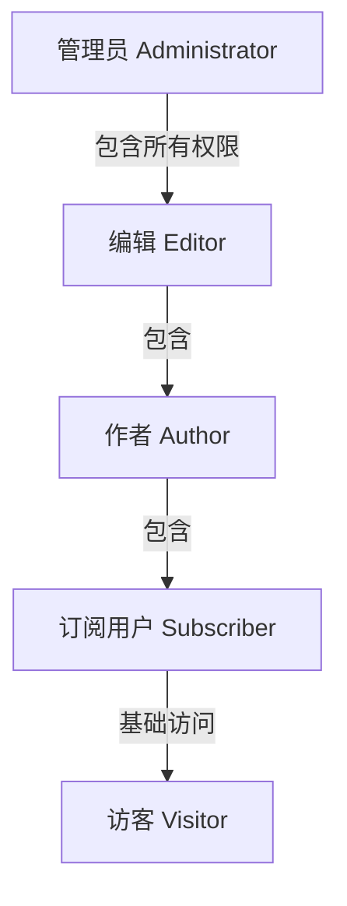
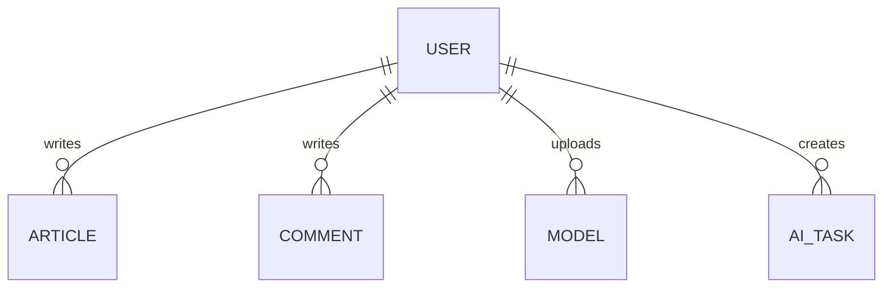
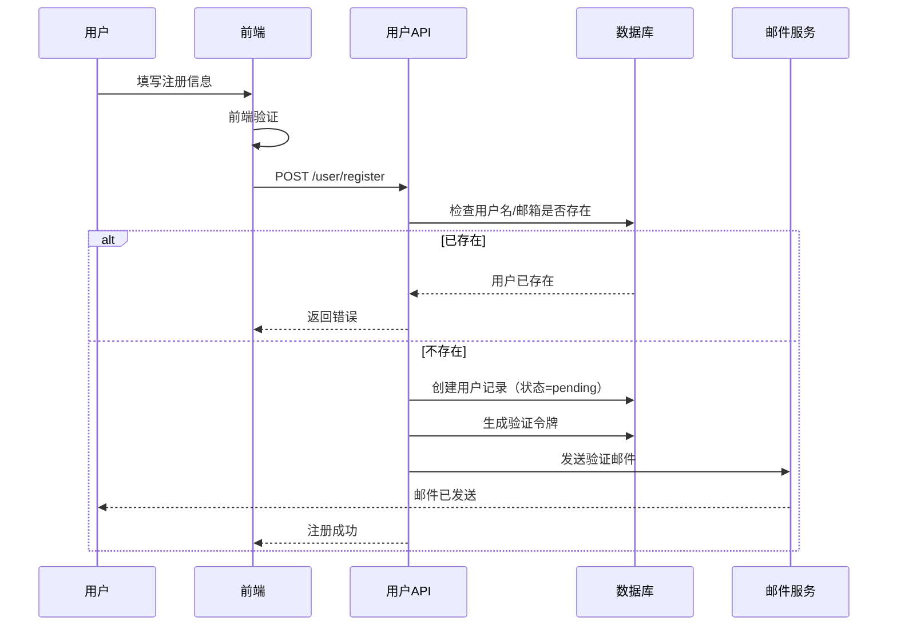
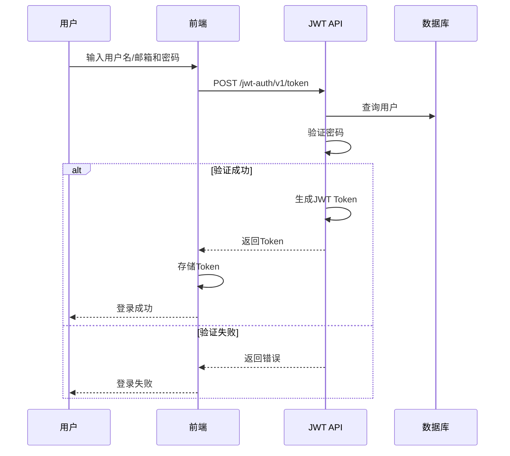
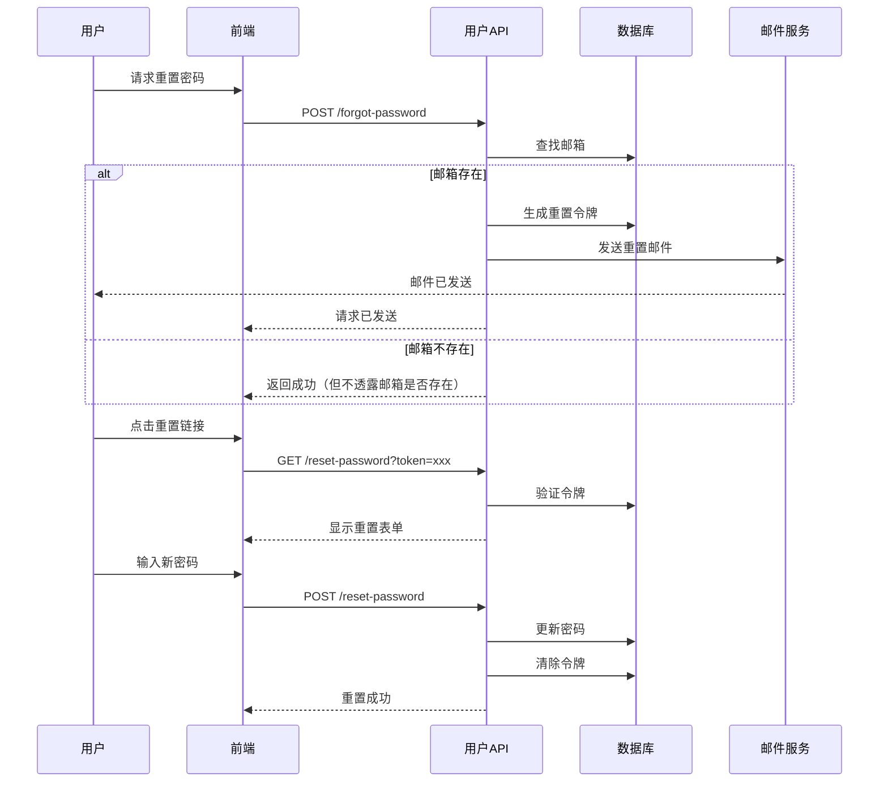

# 用户（User）

用户是小伍同学个人博客系统中的参与者，包括管理员、编辑、作者、订阅用户和访客。系统支持多角色权限管理、邮箱验证、密码找回等功能。

## 什么是用户？

用户是博客系统的参与者，根据角色拥有不同的权限。用户可以创建文章、发布评论、管理内容等。

**关键特征**:
- 支持多角色权限管理
- 支持访客注册和登录
- 支持邮箱验证和密码找回
- 可绑定社交账号
- 有详细的用户资料

## 代码位置

| 方面 | 位置 |
|------|------|
| WordPress用户系统 | WordPress核心 `users` 表 |
| 用户管理插件 | `xiaowu-user/` |
| 认证服务 | `xiaowu-user/includes/auth.php` |
| 注册服务 | `xiaowu-user/includes/registration.php` |
| 密码重置 | `xiaowu-user/includes/password-reset.php` |
| 角色管理 | `xiaowu-user/includes/roles.php` |
| 用户API | `wp-json/wp/v2/users` |
| 用户管理界面 | `admin-panel/src/components/UserManagement/` |

## 结构

```php
// WordPress用户数据结构
class WP_User {
    public $ID;                  // 用户ID
    public $user_login;          // 用户名
    public $user_pass;           // 密码（已加密）
    public $user_nicename;       // 网名
    public $user_email;          // 邮箱
    public $user_url;            // 网站URL
    public $user_registered;     // 注册时间
    public $user_activation_key; // 激活密钥
    public $user_status;         // 用户状态
    public $display_name;        // 显示名称

    // 元数据（通过get_user_meta获取）
    // first_name, last_name, description, avatar_url 等
}
```

### 关键字段

| 字段 | 类型 | 描述 | 约束 |
|------|------|------|------|
| `ID` | `integer` | 唯一标识 | 自增，不可变 |
| `user_login` | `string` | 用户名 | 唯一，3-60字符 |
| `user_email` | `string` | 邮箱 | 唯一，有效邮箱格式 |
| `user_pass` | `string` | 密码哈希 | 必需，加密存储 |
| `display_name` | `string` | 显示名称 | 可选 |
| `user_registered` | `datetime` | 注册时间 | 自动生成 |
| `user_status` | `integer` | 用户状态 | 0=正常 |

## 不变量

这些规则对有效的用户必须始终成立：

1. **用户名唯一性**: 系统中不能有两个相同的用户名
2. **邮箱唯一性**: 系统中不能有两个相同的邮箱
3. **密码安全性**: 密码必须加密存储，不能明文存储
4. **激活状态**: 未激活用户无法登录系统
5. **删除保护**: 管理员用户不能被直接删除

## 生命周期



### 状态描述

| 状态 | 描述 | 允许的转换 |
|------|------|-----------|
| `pending` | 待激活（刚注册，未验证邮箱） | → active, deleted |
| `active` | 激活，可以正常使用 | → suspended, deleted |
| `suspended` | 暂停，无法登录 | → active, deleted |
| `deleted` | 已删除（终态） | 无 |

## 角色权限



| 角色 | 描述 | 权限 |
|------|------|------|
| `administrator` | 管理员 | 所有权限 |
| `editor` | 编辑 | 编辑和发布所有文章、审核评论 |
| `author` | 作者 | 创建和发布自己的文章 |
| `subscriber` | 订阅用户 | 阅读文章、发布评论 |
| `visitor` | 访客 | 阅读公开文章（无需登录） |

## 关系



| 关联实体 | 关系 | 描述 |
|---------|------|------|
| Article | 一对多 | 用户可以写多篇文章 |
| Comment | 一对多 | 用户可以写多条评论 |
| Model | 一对多 | 用户可以上传多个3D模型 |
| AI Task | 一对多 | 用户可以创建多个AI任务 |

## 认证流程

### 注册流程



### 登录流程



### 密码重置流程



## 常见操作

### 创建用户

```php
// 创建新用户
$user_id = wp_create_user(
    'newuser',           // 用户名
    'password123',        // 密码
    'user@example.com'   // 邮箱
);

// 设置用户角色
$user = new WP_User($user_id);
$user->set_role('subscriber');

// 发送激活邮件
wp_send_new_user_notifications($user_id);
```

### 验证用户

```php
// 验证邮箱
$token = $_GET['token'];
$user = get_user_by('activation_key', $token);

if ($user) {
    update_user_meta($user->ID, 'user_status', 'active');
    delete_user_meta($user->ID, 'activation_key');
    wp_set_auth_cookie($user->ID);
}
```

### 检查权限

```php
// 检查当前用户是否有特定权限
if (current_user_can('edit_posts')) {
    // 用户可以编辑文章
}

// 检查用户角色
if (in_array('administrator', wp_get_current_user()->roles)) {
    // 用户是管理员
}
```

### 重置密码

```php
// 生成重置令牌
$key = wp_generate_password(20, false);
$hashed = time() . ':' . wp_hash_password($key);
update_user_meta($user_id, 'reset_password_key', $hashed);

// 验证令牌并重置密码
list($token_time, $token_hash) = explode(':', get_user_meta($user_id, 'reset_password_key', true));
if (wp_check_password($key, $token_hash)) {
    wp_set_password($new_password, $user_id);
    delete_user_meta($user_id, 'reset_password_key');
}
```

## 安全考虑

1. **密码强度**: 强制要求至少8位，包含字母、数字和特殊字符
2. **密码加密**: 使用 `wp_hash_password()` 和 `wp_check_password()`
3. **令牌过期**: 验证和重置令牌24小时后过期
4. **登录限制**: 限制失败登录次数，防止暴力破解
5. **双因素认证**: 可选启用2FA（预留）
6. **HTTPS**: 强制使用HTTPS传输敏感数据

## 性能考虑

- 使用 Redis 缓存用户会话
- 减少不必要的 `get_user_meta()` 调用
- 对于大量用户列表使用分页
- 使用用户对象缓存
